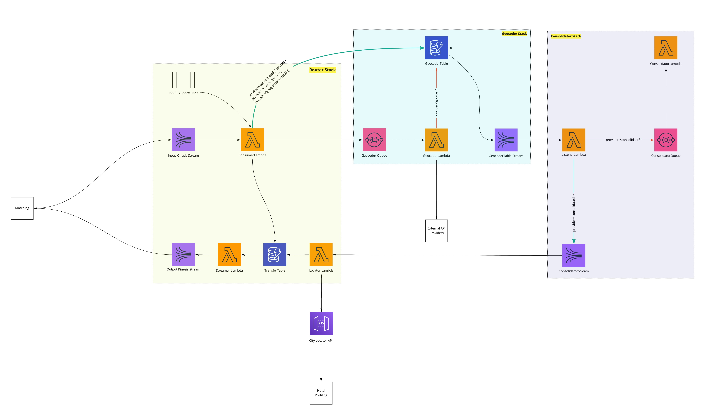

# locator-service
This repository holds the codebase for the pipeline used to assign geolocation and location details to an accommodation. 
The stacks in this repository are moved from an [older geocoder pipeline](https://github.com/trivago/ce-world-lambdas)

# Architecture
The pipeline has three stacks 

- [geocoder](#geocoder)
- [consolidator](#consolidator)
- [router](#router) 



The diagram is maintained using Miro [here](https://miro.com/app/board/o9J_ku7UcZ8=/)
The data schema of each component is maintained here (TODO update after SCC-8501)

# Components in the pipeline

## Geocoder

The geocoder deals with requests for coordinates given an address.

### Purpose of the geocoder

### API requests

A [third party geocoder](https://github.com/DenisCarriere/geocoder) package is used for deal with the low level API details.

### Result selection

Most geocoder APIs return multiple results. The geocoder does some rudimentary matching of the input address versus the returned result to determine which result is considered optimal. That means that per API, one address translates to only one pair of coordinates and not multiple versions.

## Consolidator

The consolidator finds the best coordinates for an **entity** by consolidating its **candidates**. Dependent on the entity type these candidates can be geocoding API responses, partner data, ...

For each entity type, there is a unique **approach** to consolidate the candidates. Currently supported entity types are
- accommodation
- candidate accommodation (matching team in identity)
- reference accommodation (QA purposes)
- point of interest
- candidate point of interest (POI matcher)

Each approach uses a combination of **strategies** to find the best result. Strategies include

- rulesets: rank candidates and return the top ranked
- fallback: return the coordinates of the city with the most similar name to the city the entity claims to be in

### Environment

- Python 3.6
- dependencies in requirements.txt
- psycopg2

### Running the consolidator (AWS)

Depending on the stack name, the consolidator can be triggered by the SQS queue named `${AWS::StackName}_primary` by messages of the format

```json
{
    "entity_id": 123,
    "entity_type": "string",
    "batch_id": "string"
}
```

The batch ID is optional, for valid entity types check the [validation schema](schemas/consolidator.json).

### Running the consolidator (locally)

The lambda is triggered by SQS, an example of a proper event sent to the lambda handler is

```json
{
    "Records": [
        {
            "body": "{ \"entity_type\": \"accommodation\", \"entity_id\": 1 }"
        },
        {
            "body": "{ \"entity_type\": \"point_of_interest\", \"entity_id\": 2 }"
        }
    ]
}
```

This data can be fed from a file, for example:

```python
import json

from consolidator import main

if __name__ == '__main__':
    with open('test_input.json') as test_input:
        main.lambda_handler(json.load(test_input), None)
```

Or you can setup a process to receive messages from SQS and feed them to the consolidator.

### Running the tests

1. Install dependencies from `requirements-test.txt`
2. Run the tests, make sure `PYTHONPATH=./src` is used
```
PYTHONPATH=./src python -m pytest -v tests
```

### How do we consolidate

#### Candidate unification

Certain consolidation strategies are dependent on candidates aligning on specific fields. Strategies such as rulesets and city fallback will unify those fields to one agreed upon value.

#### Strategies

##### Rulesets

The ruleset strategy uses an ordered list of rules to rank candidates. The candidate with the best rank wins and will deliver the consolidated coordinate. Each rule is a dictionary providing values for some quality criteria.

A ruleset is represented by JSON, it provides a **schema** and a list of **rules**. The schema specifies fields, which ones are **required** and which ones can be used to **filter** the rules. In the example ruleset below, every rule states a value for the (required) provider.

```json
{
    "schema": {
        "fields": [
            "provider",
            "accuracy",
            "confidence",
            "quality",
            "score",
            "country_code"
        ],
        "required": [
            "provider"
        ],
        "filter": [
            "country_code"
        ]
    },
    "rules": [
        {
            "provider": "google",
            "accuracy": "ROOFTOP",
            "confidence": "9.0",
            "quality" : "political"
        },
        {
            "provider": "tomtom",
            "confidence": "10.0",
            "quality" : "Point Address"
        },
        {
            "provider": "google",
            "accuracy": "ROOFTOP",
            "confidence": "8.0",
            "quality" : "political"
        },
        {
            "provider": "mapbox",
            "accuracy": "interpolated",
            "quality" : "0.9",
            "country_code": "US"
        },
        {
            "provider": "tomtom",
            "confidence": "10.0",
            "quality" : "Point Address",
            "country_code": "US"
        }
    ]
}
```

Let's say we have three candidates for an entity:

```json
[
    {
        "provider": "google",
        "longitude": 45.8941,
        "latitude": -23.9191,
        "accuracy": "ROOFTOP",
        "confidence": "8.0",
        "quality": "political"
    },
    {
        "provider": "tomtom",
        "longitude": 45.1192,
        "latitude": -23.4723,
        "confidence": "10.0",
        "quality" : "Point Address",
        "country_code": "US"
    },
    {
        "provider": "mapbox",
        "longitude": 45.5912,
        "latitude": -23.9220,
        "accuracy": "interpolated",
        "quality" : "0.9",
        "country_code": "MX"
    }
]
```

The candidates do not align on a country code; one does not specify a country, the others state US or MX. Because of the lack of consensus, the default rules are used, which are all the rules that do not specify a value for country code.

The tomtom candidate wins, since it matches the second rule and therefore receives a rank of 2. The google candidate matches the third rule and receives a (lower) rank of 3. There are no (default) rules for the mapbox provider, and therefore it is ignored. If there were (default) rules but with different quality criteria than those provided by the mapbox candidate, it would also be ignored.

Keep in mind that the following candidate will receive a rank of 1, even though the `score` field is not present in the matching rule. By absence, the rule implicitly allows for any value of `score`.

```json
{
    "provider": "google",
    "accuracy": "ROOFTOP",
    "confidence": "9.0",
    "quality" : "political",
    "score": 6.0
}
```

Since country code is a filter field, it can be used to filter more specific rules for different countries. If for an entity, we have the following candidates:

```json
[
    {
        "provider": "google",
        "longitude": 45.8941,
        "latitude": -23.9191,
        "accuracy": "ROOFTOP",
        "confidence": "8.0",
        "quality": "political",
        "country_code": "US"
    },
    {
        "provider": "tomtom",
        "longitude": 45.1192,
        "latitude": -23.4723,
        "confidence": "10.0",
        "quality" : "Point Address",
        "country_code": "US"
    },
    {
        "provider": "mapbox",
        "longitude": 45.5912,
        "latitude": -23.9220,
        "accuracy": "interpolated",
        "quality" : "0.9",
        "country_code": "US"
    }
]
```

Then the mapbox candidate is top ranked, since it has a rank of 1 (imagine all rules are removed except for those with country code US). Event though the tomtom candidate is also present in this filtered list of rules, its rank is 2, lower than that of mapbox.

##### City (fallback)

The city fallback uses city name information to find a match to our city database and return the city coordinate. This is generally used as a last resort since it will increase the number of coordinate duplicates.

Candidates also align on city and country code in fallback. For the city, the most common non null value is chosen. For the country code, the non null values must be unanimous. The country code is used for country exclusion, since the same city name can occur in multiple countries.

## Router

The router component is a wrapper around the geocoder pipeline in order to interact with the Kinesis streams of the matcher team and satisfy certain business requirements:
- A verdict is sent back after 3 hours of receiving the candidate accommodation. The verdict is either the geocodes, locality and country IDs, or nothing at all.
- The matcher team can flag candidate accommodations as having good coordinates; such candidates are forwarded to the city locator where they receive a locality and country ID.

### Purpose of the router

The router is a wrapper around the geocoder pipeline. In order to ensure a result is returned, a transfer table (DynamoDB) keeps track of candidates. A candidate resides in the table for 3 hours, during which they can receive updates (geocodes, locality ID, country ID, ...). After 3 hours the candidate result, empty or not, is streamed out in protobuf format to the output Kinesis stream.

#### Consumer (Lambda)

The consumer Lambda listens to a Kinesis stream and parses the protobuf messages to JSON. The producer has control over whether a candidate goes through the geocoder pipeline (where they receive coordinates) or whether they can skip ahead to the city locator (where they receive a locality and country ID using coordinates).

#### Locator (Lambda)

At the end of the geocoder pipeline, candidates will have coordinates. These coordinates are used to call an API from Hotel Profiling. The API will return locality and country IDs. The candidate is updated in the transfer table.

#### Streamer (Lambda)

After sitting in the transfer table for 3 hours, the candidate is streamed out to a Kinesis stream in protobuf format. If no coordinates or locality and country ID was found, only the protobuf key value will be non null.

### Environment

- Python 3.7
- dependencies in requirements.txt

---

# Deployment

The stacks has to be deployed in the order 

- geocoder
- consolidator
- router

All stacks can be deployed using the `makefile` in the root directory 
TODO - update after SCC-8502